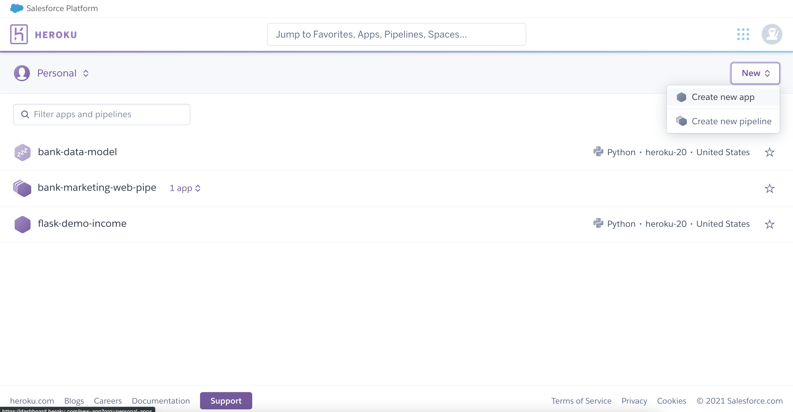
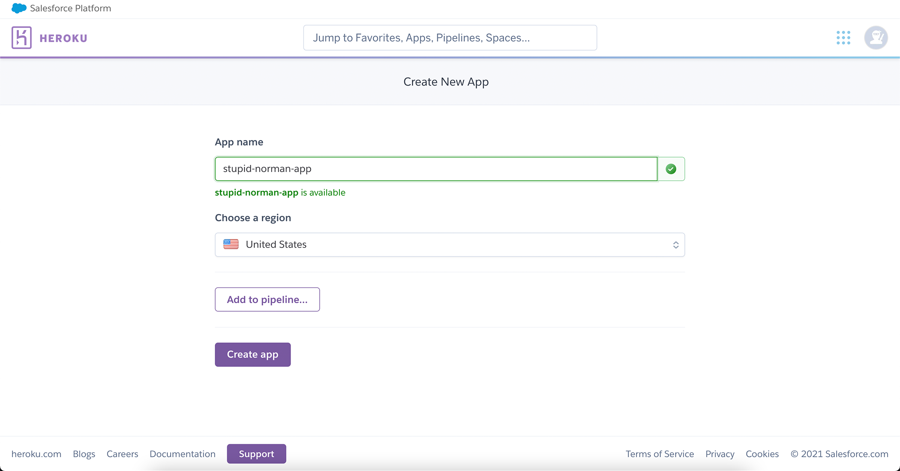
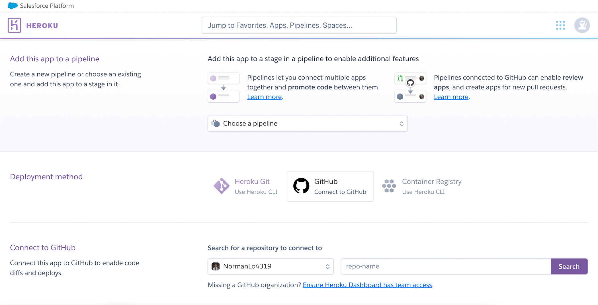
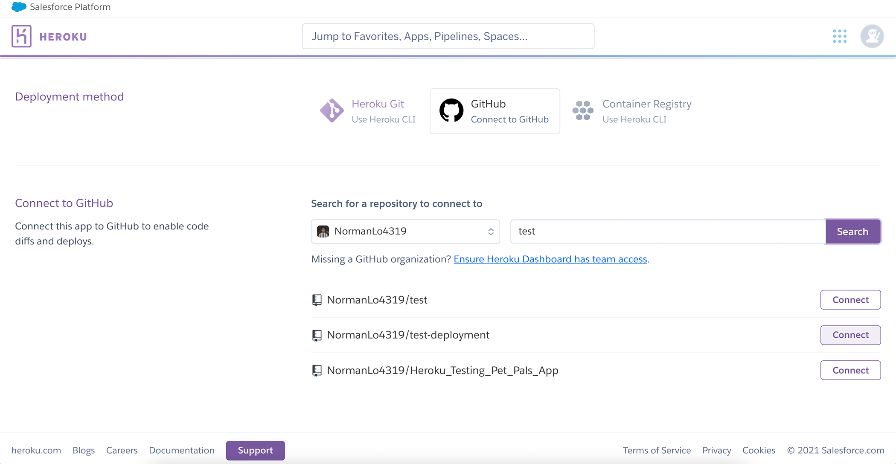

# Flask App Deployment Demo

This repository demonstrates the steps for setting up a simple ML model and deploy with Flask App that lives on Heroku environment.

## Deployment

Generally speaking, deployment is the mehtod by which we integrate a machine learning model into an existing production environment to make practical business decision based on data. The purpose of deploying a model is so that we can make the predictions from a trained ML model available to others, whether that be users, management, or other systems. Model deployment is closely related to ML system architecture, which refers to the arrangement and interactions of software components within a system to achieve a predefined goal.

## Flask Framework

Flask is a micro web framwork written in Python. It is classified as a microframework because it does not require particular tools or libraries. To build a Flask app that runs a ML model in the background for prediction, we need to make sure the app contains the following key elements:

Key Elements in the Project Structure:

1. model.pkl: This contains the machine learning model to make prediction.
2. app.py: This contains Flask APIs that receives input through API calls, then computes predicted value based on our model and returns it.
4. HTML/CSS: This contains the HTML template and CSS styling to allow user to enter the credentials.

## Project Workflow

### 1. Create a new conda environment for the project

Terminal:

``` sh
conda info --envs # check the current project environment
conda create -n flask_demo python=3.8 # create the flask_demo environment for the project
conda activiate flask_demo # activate the flask_demo environment for the project
cd Desktop/Flask_Demo # CD to the Demo folder that contains the project components
pip install flask # install flask to this project environment
pip install gunicorn # install gunicorn to this project environment
```

### 2. Create the components with Visual Studio Code:

1. Go to the Flask_Demo folder
2. Create the "app.py" file
3. Create the "requirements.txt" file
4. Create the "Profile" file
5. Create the "runtime.txt" file
6. Create a "templates" folder
7. Create the index.html and result.html files inside the "templates" folder
8. Create a "static" folder and a "css" folder within the "static" folder
9. Create the "style.css" file inside the "css" folder
10. Create a "model" folder
11. Save or copy the "model.pkl" file inside the "model" folder

Structure of the folders and files in the project folder:

~~~
  ├── model
    ├── model.pkl
  ├── static
    ├── css
      ├── style.css
  ├── templates
    ├── index.html
    ├── result.html
  ├── Procfile
  ├── app.py
  ├── requirements.txt
  └── runtime.txt
~~~

### 3. Code each of the component in the project

#### app.py File: 

This file is the core of the *Flask application*, which instantiate the Flask object. The structure of the app.py file is demonstrated below.  

``` Python
# Import dependencies for the Flask app
from flask import Flask, render_template, request, jsonify
import pickle

# Create the application
app = Flask(__name__)

# Something in between ....

# Run the app
if __name__ == "__main__"
  app.run()
```

Note: The code will be provided in the lecture, so you don't have to worry about the "Something in between ... " part of this structure.

#### requirements.txt File:

By convention, Python packages often include a plaintext file named requirements.txt, in which the dependencies for the package are listed on each line. Create an empty file named requirements.txt in the same root folder as app.py. The dependencies can be found by running the following code in the terminal (under the project environment).

``` sh
pip freeze # freeze all the dependencies in the environment
```

Alternatively, we can also export this list of packages in the development environment to a requirements.txt file directly by the following code:

``` sh
pip freeze > requirements.txt
```

Note: Just maker sure that you are in the right directory (root directory) to export this list.

#### runtime.txt File:

Heroku will know that we be running a Python app, but because there's a huge disparity between Python versions (notably, Python 2 versus 3), we need to tell Heroku to use the Python version that we're using on our own computer to develop our app. Create runtime.txt in your root app folder and add just the single line. The Python version in the project environment can be found with the following code in the terminal.

``` sh
python --version # checking the Python version in the development environment
```

#### Procfile File:

This is just a plaintext file that tell Heroku how to start up the web app. By convention, this file is just a plaintext file called "Procfile", which is in the root directory of the application that defines process types and explicitly declares what command should be executed to start the app. The Procfile contains just this line:

``` 
web: gunicorn app:app
```

NOTE: Make sure you mannually do ```pip install gunicorn``` to the development environment before creating the requirements.txt file.  The gunicorn package is required for the final deployment process on Heroku, which is not required for running in the local environment, so you could easily miss it at the final stage.

### 3. Put your code into the HTML, CSS, and .py files

The code will be provided to students in the lecture. For now, just sit and relex!

### 4. Run the Flask App in the Dev Environment

Before deploying the Flask app, we need to make sure everything run smoothly and correctly in the development environment.

Terminal:

``` sh
cd Desktop/Flask_Demo # cd to the project folder
python app.py # run the app locally
```

Note: If there is any missing modules in the environment, pip install them until the Flask App can be launched.

### 5. Deploy the Flask App on Heroku

Step 1: Login to your Heroku account so you can see the Dashboard of your projects

Step 2: Click on "New" the dropdown menu and select "Create new app"



Step 3: Give your app a name that is available to use, then click "Create app"



Step 4: Connect to your GitHub account by clicking the GitHub Box under "Deployment method"



Step 5: Searh the GitHub Repo name for your project under "Connect to GitHub", then click connect



Step 6: Scroll all the way down to the page and click on "Manual Deployment"

**If everything goes through, your Flask app should now be living on Heroku server and ready to use!!**

**Alternatively, if some error messages come up, this is the stage that frustrate most people, which is DEBUGGING!!!**

### Resources:

Copyright © 2021 Norman Lo
